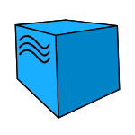

# **Проект автоматизации тестирования сайта petstore.octoperf.com**

# Содержание
___
* Описание
* Технологии и инструменты
* Реализованные проверки
* Запуск тестов
* Допустимые комбинации
* Локальный запуск тестов
* Удаленный запуск тестов
* Cборка тестов в Jenkins
* Интеграция с Allure Report
* Диаграммы прохождения тестов
* Интеграция с Allure TestOps
* Интеграция с Jira
* Уведомления в Telegram с использованием бота
* Пример выполнения теста в Selenoid

# Технологии и инструменты
___

              

# Описание 
___